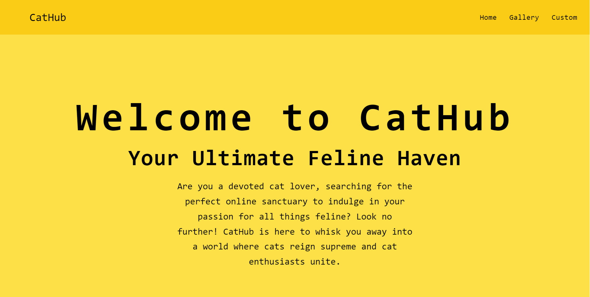
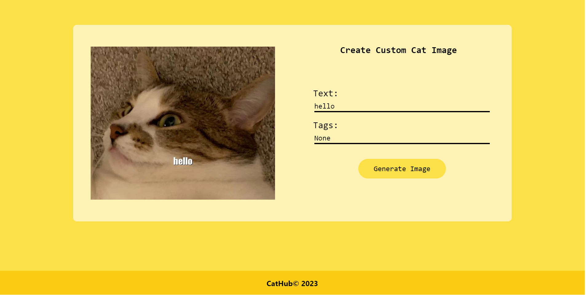
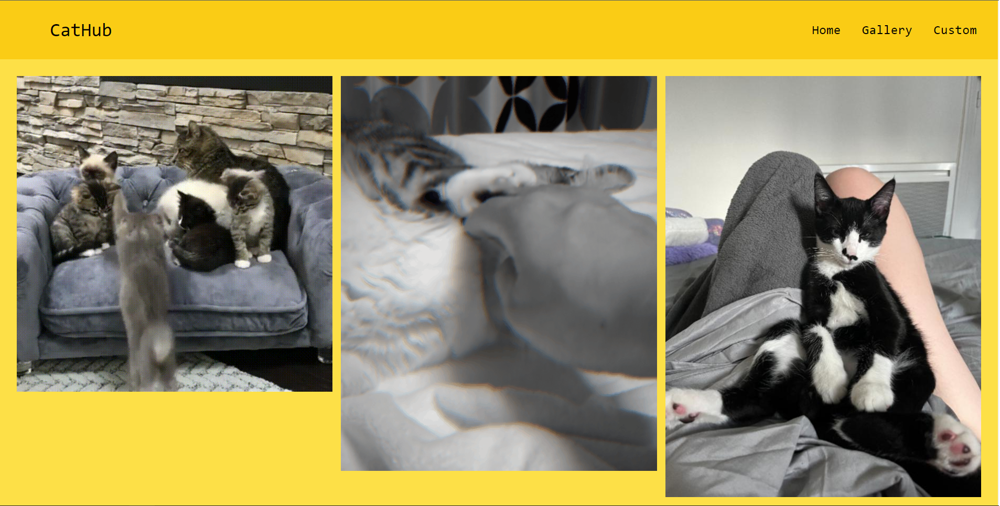
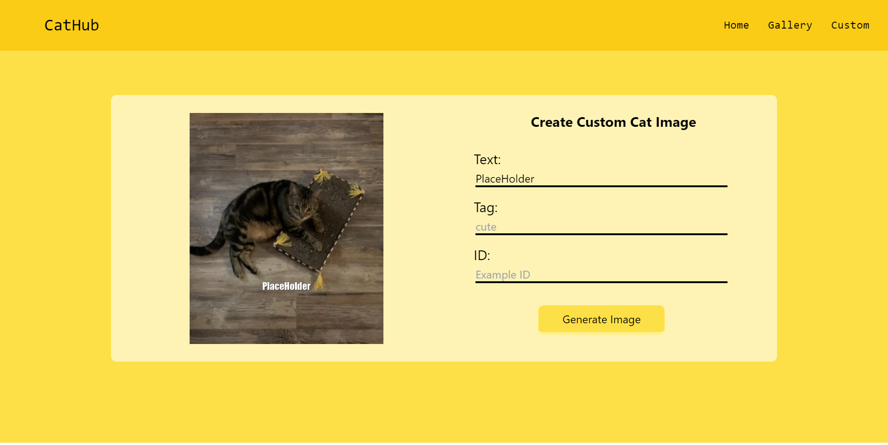

## CatHub






## General Info

Project made using React, TypeScript and TailwindCSS

## Setup

To run this project, install it locally using npm:

```
$ cd todo-app
$ npm install
$ npm run dev
```
